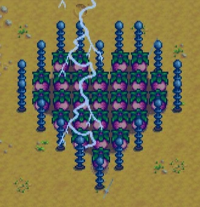

# dancoe77's Stardew Valley mods

This is a list of all Stardew Valley mods that I am currently maintaining.

Big shout out to Shockah for the original source code which can be found here [Shockah](https://github.com/Shockah/Stardew-Valley-Mods). Issues or ideas can be reported via [the GitHub issues page](https://github.com/dancoe77/007-Stardew-Valley-Nods/issues)

**Note:** The below list only includes mods I have made a README for.\
# Safe Lightning Redux

\
Never worry about lightning strikes again! Prevents lightning from striking any tiles or fruit trees.\
\[[source code](SafeLightning)]
